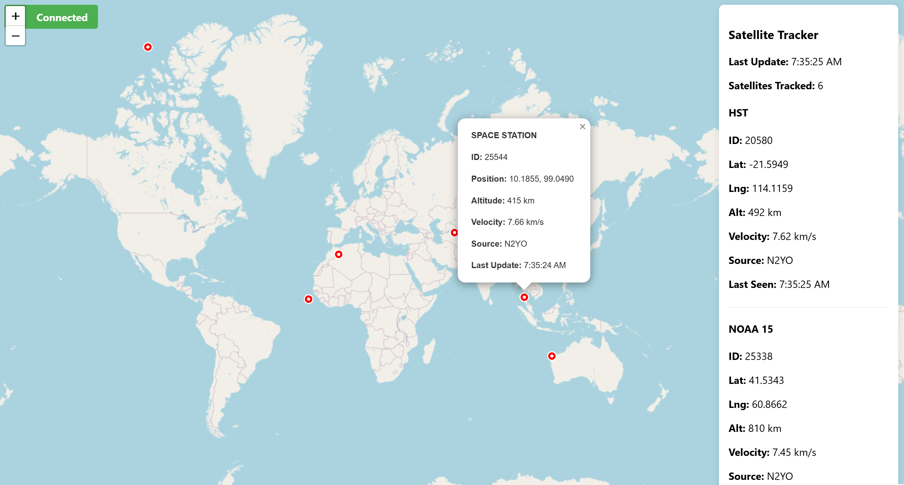

# Satellite Map Viewer

A real-time satellite tracking application that consumes Kafka events from [satellite-tracking-kafka-producer](https://github.com/KyleBurney/satellite-tracking-kafka-producer) and displays satellite positions on an interactive map.



## Architecture

- **Backend**: Node.js server with Kafka consumer and WebSocket server
- **Frontend**: React app with Leaflet maps for visualization
- **Communication**: WebSocket for real-time updates from backend to frontend
- **Serialization**: Apache Avro for serializing Kafka events

## Prerequisites

- Node.js (v18+)
- Running Kafka cluster (localhost:9092)
- Running Avro Schema Registry (localhost:8081)
- Running [satellite-tracking-kafka-producer](https://github.com/KyleBurney/satellite-tracking-kafka-producer) app producing to `satellite-position-events` topic

## Setup

1. Install backend dependencies:
```bash
npm install
```

2. Install frontend dependencies:
```bash
cd client
npm install
```

## Running the Application

1. Start the backend server:
```bash
npm run dev
```

2. In a new terminal, start the React frontend:
```bash
cd client
npm run dev
```

3. Open your browser to `http://localhost:3000`

## Features

- Real-time satellite position tracking
- Interactive world map with satellite markers
- Satellite information panel showing:
  - Satellite ID and name
  - Current coordinates (latitude/longitude)
  - Altitude and velocity
  - Data source
  - Last update timestamp
- Connection status indicator
- Automatic reconnection on WebSocket disconnection

## API Endpoints

- `GET /health` - Health check endpoint showing server status and connected clients